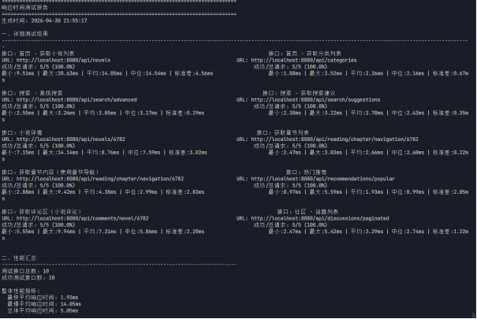

# 接口性能压测报告 · 小说推荐与评论系统

> 本报告为**热点读接口的基线压测**，用于确认首屏链路（首页、分类、搜索、阅读进度）的响应性能，
> 并作为后续优化（索引调整、缓存策略变更）的对比基线。

---

## 一、测试概要

| 项目 | 数据 |
|---|---|
| 测试时间 | 2026-04-28 21:55:17 |
| 测试接口数 | 10 个 |
| 每接口轮次 | 5 轮 |
| 成功率 | 100% |
| 单次请求上限 | 500 ms |

### 整体响应时间

| 指标 | 数值 |
|---|---|
| **平均响应时间** | **5.05 ms** |
| 最快 | **1.93 ms** |
| 最慢 | **14.05 ms** |
| 标准差 | 2.83 ms |

---

## 二、测试范围

本轮覆盖 10 个高频**只读**接口，均为用户打开应用时最先被调用的链路：

| 接口功能 | 说明 |
|---|---|
| 小说列表 | 首页/分类页列表加载 |
| 首页推荐 | 推荐结果获取 |
| 分类列表 | 分类导航加载 |
| 关键词搜索 | 搜索入口 |
| 搜索建议 | 搜索框联想 |
| 阅读进度查询 | 继续阅读定位 |
| 热门推荐 | 未登录用户的降级推荐 |
| 评论列表分页 | 详情页评论加载 |

> 说明：**写接口与个性化推荐算法链路（需登录态、依赖用户行为数据）未纳入本轮测试**。
> 推荐算法链路涉及行为表查询、相似用户计算与分类标签偏好统计，是后续需要重点观测的性能环节。

---

## 三、测试结论

1. **热点读接口性能良好**：10 个接口全部成功（成功率 100%），平均响应 5.05 ms，
   最慢 14.05 ms，远低于 500 ms 的单次请求上限，首屏链路无明显性能瓶颈。
2. **响应稳定性较好**：标准差 2.83 ms，相对平均值波动约 56%，
   主要来自搜索类接口（涉及模糊匹配），属可接受范围。
3. **未做索引优化的前提下已达标**：本轮数据为**基线值**，
   后续如对章节列表、评论查询等高基数字段补充索引，可进一步降低长尾耗时。

---

## 四、后续优化计划

- [ ] 对章节列表、评论分页类查询做 `EXPLAIN` 分析，补充复合索引并复测对比
- [ ] 将个性化推荐算法链路纳入压测范围（构造测试用户与行为数据）
- [ ] 补充带缓存 / 不带缓存的接口耗时对比，量化 Redis 缓存收益
- [ ] 在更高数据量级（万级小说、十万级章节）下复测，观察索引与分页表现

---

## 五、复现方式

测试环境与工具配置：

| 项目 | 配置 |
|---|---|
| 部署方式 | 本地部署（后端 Spring Boot + MySQL 8 + Redis） |
| 压测工具 | 【待填：如 Postman Runner / JMeter / Apifox】 |
| 请求参数 | 【待填：并发数、轮次、超时设置】 |

**复现步骤**

```bash
# 1. 启动依赖
#    MySQL 8（导入 novel_db）+ Redis

# 2. 启动后端
cd novel-system
mvn spring-boot:run

# 3. 按上表接口清单执行压测（每接口 5 轮，超时上限 500ms）
```

---

## 附录：原始报告



原始报告截图见同目录 `api-perf-report.png`。
